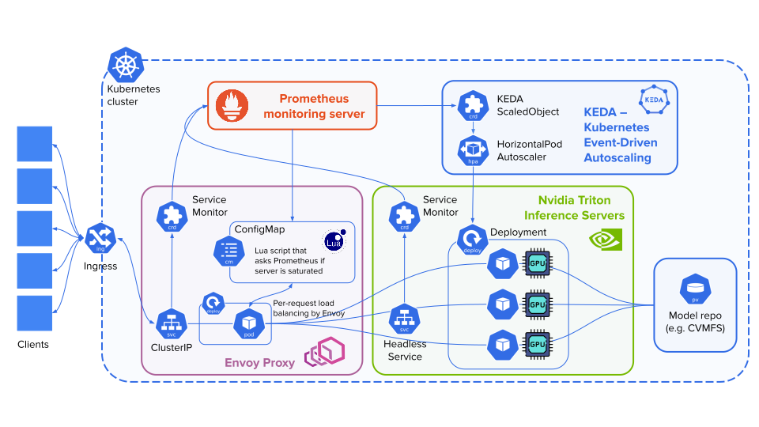

# SONIC Server Infrastructure

This Helm chart will install components depicted at the diagram below, excluding Prometheus and model repository, which must be connected by specifying relevant parameters in configuration file (see configuration reference below).

In its current form, the chart allows to deploy multiple server instances with different settings at once. This can be useful if you need to host servers with different GPU models, different Triton server versions, or different model repository mounts. 

For correct behavior, the server saturation metric (`servers[].prometheus.serverAvailabilityMetric`) used by Envoy proxy and autoscaler must be carefully defined.
It is recommended to start with examining the metric in Prometheus interface, in order to
define an appropriate threshold and avoid typos in the metric definition.

The KEDA autoscaler can be enabled / disabled via the `servers[].autoscaler.enabled` parameter.



## Table of Contents

- [Installation](#installation)
- [Parameters](#parameters)
    - [servers](#servers)
        - [triton](#triton)
        - [envoy](#envoy)
        - [prometheus](#prometheus)
        - [autoscaler](#autoscaler)
        - [ingress](#ingress)
    - [common](#common)
        - [tritonService](#tritonservice)
        - [envoyService](#envoyservice)
        - [affinity](#affinity)


## Installation

Modify the following command to install the chart at your cluster:

```shell
helm upgrade --install sonic-load-balancers ./helm --values helm/values.yaml -n <namespace>
```

## Parameters

#### servers

- `servers`: List of server configurations: it is possible to deploy several configurations at the same time, for example when different server setups are needed for different workflows.

##### triton

- `servers[].triton.name`: **(string)** Name of the Nvidia Triton inference server deployment.

- `servers[].triton.replicas`: **(int)** Number of Triton replicas when autoscaling is disabled.

- `servers[].triton.image`: **(string)** Docker image for the Triton server.

- `servers[].triton.command`: **(list)** Command to run in the Triton container.

- `servers[].triton.args`: **(list)** Arguments for the command.

- `servers[].triton.resources`: **(object)** Resource requests and limits for the Triton server.
  - `limits`: Resource limits.
    - `nvidia.com/gpu`: **(int)** Number and type of GPUs to allocate.
    - `cpu`: **(string)** CPU limit.
    - `memory`: **(string)** Memory limit.
  - `requests`: Resource requests.
    - `nvidia.com/gpu`: **(int)** Number and type of GPUs to request.
    - `cpu`: **(string)** CPU request.
    - `memory`: **(string)** Memory request.

- `servers[].triton.modelRepository`: **(object)** Configuration for the model repository.
  - `storageType`: **(string)** Type of storage for the model repository. Possible options are `nfs`, `pvc`, `cvmfs`, `cvmfs-pvc`, `s3`. 
  - `mountPath`: **(string)** Mount path for the model repository inside the container.

##### envoy

- `servers[].envoy.enabled`: **(bool)** Enable Envoy Proxy.

- `servers[].envoy.name`: **(string)** Name of the Envoy deployment.

- `servers[].envoy.replicas`: **(int)** Number of Envoy replicas.

- `servers[].envoy.image`: **(string)** Docker image for Envoy.

- `servers[].envoy.args`: **(list)** Arguments for the Envoy container.

- `servers[].envoy.resources`: **(object)** Resource requests and limits for Envoy.
  - `requests`:
    - `cpu`: **(string)** CPU request.
    - `memory`: **(string)** Memory request.
  - `limits`:
    - `cpu`: **(string)** CPU limit.
    - `memory`: **(string)** Memory limit.

- `servers[].envoy.configs`: **(object)** Configuration files for Envoy.
  - `envoyConfig`: **(string)** Path to the Envoy configuration file.
  - `luaConfig`: **(string)** Path to the Lua configuration file.

- `servers[].envoy.loadBalancerPolicy`: **(string)** Load balancing policy for Envoy.

##### prometheus

- `servers[].prometheus.url`: **(string)** URL of the Prometheus server.

- `servers[].prometheus.port`: **(int)** Port of the Prometheus server.

- `servers[].prometheus.scheme`: **(string)** Scheme for Prometheus (`http` or `https`).

- `servers[].prometheus.serverAvailabilityMetric`: **(string)** Prometheus query for server availability (saturation).

- `servers[].prometheus.serverAvailabilityThreshold`: **(int)** Threshold for server availability metric.

##### autoscaler

- `servers[].autoscaler.enabled`: **(bool)** Enable the autoscaler.

- `servers[].autoscaler.minReplicas`: **(int)** Minimum number of replicas.

- `servers[].autoscaler.maxReplicas`: **(int)** Maximum number of replicas.

##### ingress

- `servers[].ingress.enabled`: **(bool)** Enable ingress for the service.

- `servers[].ingress.hostName`: **(string)** Hostname for ingress.

#### common

- `common.tritonService`: **(object)** Configuration for the Triton service.
  - `labels`: **(object)** Labels for the Triton service.
  - `annotations`: **(object)** Annotations for the Triton service.
  - `ports`: **(list)** List of ports exposed by the Triton service.
    - Each port entry includes:
      - `name`: **(string)** Name of the port.
      - `port`: **(int)** External port.
      - `targetPort`: **(int)** Container port.
      - `protocol`: **(string)** Protocol.

- `common.envoyService`: **(object)** Configuration for the Envoy service.
  - `type`: **(string)** Kubernetes service type.
  - `labels`: **(object)** Labels for the Envoy service.
  - `ports`: **(list)** List of ports exposed by the Envoy service.
    - Each port entry includes:
      - `name`: **(string)** Name of the port.
      - `port`: **(int)** External port.
      - `targetPort`: **(int)** Container port.

- `common.affinity`: **(object)** Affinity rules for pod scheduling.
