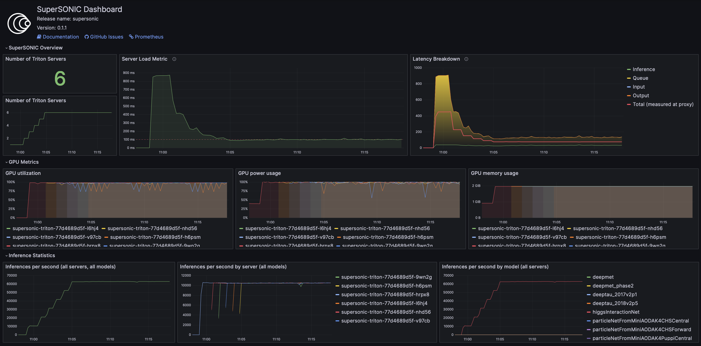

Configuration Guide
####################

The following guide will help you configure ``values.yaml`` file for a SuperSONIC deployment.
The full list of parameters can be found in the `Configuration Reference <configuration-reference>`_.

You can find example values files in the `SuperSONIC GitHub repository <https://github.com/fastmachinelearning/SuperSONIC/tree/main/values>`_.

1. Select a Triton Inference Server Version
=============================================

- Official versions can be found at `NVIDIA NGC <https://ngc.nvidia.com/catalog/containers/nvidia:tritonserver>`_.
- You can also use custom-built Triton images.
- Refer to the `Nvidia Frameworks Support Matrix <https://docs.nvidia.com/deeplearning/frameworks/support-matrix/index.html>`_ 
  for compatibility information (CUDA versions, NVIDIA drivers, etc.).

Triton version must be specified in the ``triton.image`` parameter in the values file.

2. Configure Triton model repository
=============================================
   
- To learn about the structure of model repositories, refer to the
  `NVIDIA Model Repository Guide <https://docs.nvidia.com/deeplearning/triton-inference-server/user-guide/docs/user_guide/model_repository.html>`_.
- Model repositories are specified in the ``triton.args`` parameter in the values file.
  The parameter contains the full command that launches a Triton server; you can specify
  one or multiple model repositories via the ``--model-repository`` flag.
- For example, the following command loads multiple CMS models hosted at CVMFS:
     
.. code-block:: yaml

   args: 
     - |
      /opt/tritonserver/bin/tritonserver \
      --model-repository=/cvmfs/cms.cern.ch/el9_amd64_gcc12/cms/cmssw/CMSSW_14_1_0_pre7/external/el9_amd64_gcc12/data/RecoBTag/Combined/data/models/ \
      --model-repository=/cvmfs/cms.cern.ch/el9_amd64_gcc12/cms/cmssw/CMSSW_14_1_0_pre7/external/el9_amd64_gcc12/data/RecoEgamma/EgammaPhotonProducers/data/models/ \
      --model-repository=/cvmfs/cms.cern.ch/el9_amd64_gcc12/cms/cmssw/CMSSW_14_1_0_pre7/external/el9_amd64_gcc12/data/RecoTauTag/TrainingFiles/data/DeepTauIdSONIC/ \
      --model-repository=/cvmfs/cms.cern.ch/el9_amd64_gcc12/cms/cmssw/CMSSW_14_1_0_pre7/external/el9_amd64_gcc12/data/RecoMET/METPUSubtraction/data/models/ \
      --allow-gpu-metrics=true \
      --log-verbose=0 \
      --strict-model-config=false \
      --exit-timeout-secs=60 

- Make sure that the model repository paths exist. You can load models from a volume mounted to the Triton container.
  The following options for model repository mounting are provided via ``triton.modelRepository`` parameter in ``values.yaml``:

.. raw:: html

    

    
Model repository options

.. code-block:: yaml

   # -- Model repository configuration
   modelRepository:
     # Set to `true` to enable model repository mounting
     enabled: true

     # -- Model repository mount path (e.g /cvmfs/)
     mountPath: ""

     ## Model repository options:

     ## Option 1: mount an arbitrary PersistentVolumeClaim
     storageType: "pvc"
     pvc:
       claimName: 

     ## -- OR --
     ## Option 2: mount CVMFS as PersistentVolumeClaim (CVMFS StorageClass must be installed at the cluster)
     storageType: "cvmfs-pvc"
     
     ## -- OR --
     ## Option 3: mount CVMFS via hostPath (CVMFS must be already mounted on the nodes)
     storageType: "cvmfs"

     ## -- OR --
     ## Option 4: mount an NFS storage volume
     storageType: "nfs"
     nfs:
       server:
       path:

.. raw:: html

   

.. raw:: html

      

3. Select Resources for Triton Pods
=============================================

- You can configure CPU, memory, and GPU resources for Triton pods via the ``triton.resources`` parameter in the values file:

.. code-block:: yaml

   resources:
     limits:
       nvidia.com/gpu: 1
       cpu: 2
       memory: 16G
     requests:
       nvidia.com/gpu: 1
       cpu: 2
       memory: 16G

- In addition, you can use ``triton.affinity`` to steer Triton pods to nodes with specific GPU models:

.. code-block:: yaml

   affinity:
     nodeAffinity:
       requiredDuringSchedulingIgnoredDuringExecution:
         nodeSelectorTerms:
           - matchExpressions:
             - key: nvidia.com/gpu.product
               operator: In
               values:
                 - NVIDIA-A10
                 - NVIDIA-A40
                 - NVIDIA-L40
                 - NVIDIA-L4

4. Configure Envoy Proxy
================================================

By default, Envoy proxy is enabled and configured to provide per-request
load balancing between Triton inference servers.

Once the SuperSONIC chart is installed, you need an address by which clients
can connect to the Envoy proxy and send inference requests.

There are two options:

-  **Ingress** (recommended): Use an Ingress to expose the Envoy proxy to the outside world.
   You can configure the Ingress resource via the ``envoy.ingress`` parameters in the values file:

   .. code-block:: yaml

      envoy:
        ingress:
          enabled: true
          hostName: "<ingress_url>"
          ingressClassName: "<ingress_class>"
          annotations: {}

   In this case, the client connections should be established to  ``<ingress_url>:443`` and use SSL.

   For information on how to configure Ingress for your cluster, please refer to cluster documentation or contact cluster administrators.

-  **LoadBalancer Service**: This option allows to expose the Envoy proxy without using Ingress, but it may
   not be allowed at some Kubernetes clusters. To enable this, set the following parameters in the values file:

   - ``envoy.service.type: LoadBalancer``
   - ``envoy.ingress.enabled: false``
  
   The LoadBalancer service can then be mapped to an external URL, depending on the settings of a given cluster.
   Please contact cluster administrators for more information.

   In this case, the client connections should be established to  ``<load_balancer_url>:8001`` and NOT use SSL.

5. (Optional) Configure Rate Limiting in Envoy Proxy
======================================================
   
There are two types of rate limiting available in Envoy Proxy: *listener-level*, and *prometheus-based*.

- **Listener-level rate limiting** allows to explicitly limit the number of client connections established to the Envoy proxy endpoint.
  It can be useful to prevent overloading the proxy with too many simultaneous client connections.

  The listener-level rate limiting is implemented via "token bucket" algorithm.
  Each new connection consumes a token from the bucket, and the bucket is refilled at a constant rate.

  Example configuration in ``values.yaml``:

  .. code-block:: yaml

     envoy:
       enabled: true
       rate_limiter:
         listener_level:
           # -- Enable rate limiter
           enabled: false
           # -- Maximum number of simultaneous connections to the Envoy Proxy.
           max_tokens: 5
           # -- ``tokens_per_fill`` tokens are added to the "bucket" every ``fill_interval``, allowing new connections to be established.
           tokens_per_fill: 1
           # -- For example, adding a new token every 12 seconds allows 5 new connections every minute.
           fill_interval: 12s

- **Prometheus-based rate limiting** allows an additional layer of rate limiting based on a metric queried from a Prometheus server.
  This can be useful to dynamically control server load and stop accepting new connections when GPUs are saturated.

  This rate limiter can be enabled via the ``envoy.rate_limiter.prometheus_based`` parameter in the values file.

  At the moment, this functionality is configured to only reject ``RepositoryIndex`` requests to Triton servers, and it ignores
  any other requests in order not to slow down the inferences.

  The metric and threshold for the Prometheus-based rate limiter are the same as those used for the autoscaler (see Prometheus Configuration).

6. (Optional) Configure Authentication in Envoy Proxy
======================================================

At the moment, the only supported authentication method is JWT. Example configuration for IceCube:

.. code-block:: yaml

   envoy:
     auth:
       enabled: true
       jwt_issuer: https://keycloak.icecube.wisc.edu/auth/realms/IceCube
       jwt_remote_jwks_uri: https://keycloak.icecube.wisc.edu/auth/realms/IceCube/protocol/openid-connect/certs
       audiences: [icecube]
       url: keycloak.icecube.wisc.edu
       port: 443

7. Deploy a Prometheus Server or Connect to an Existing One
============================================================

Prometheus is needed to scrape metrics for monitoring, as well as for the rate limiter and autoscaler.

- **Option 1** (recommended): Deploy a new Prometheus server.

  This will allow to configure a shorter scraping interval, resulting in a more responsive
  rate limiter and autoscaler. Prometheus server typically uses only a small amount of resources
  and does not require special permissions for installation.

  This option installs Prometheus as a subchart, the default values for it are set to reasonable values.
  You can further customize the Prometheus installation by passing parameters from
  official Prometheus `values.yaml <https://github.com/prometheus-community/helm-charts/blob/main/charts/prometheus/values.yaml>`_ file
  under the ``prometheus`` section of the SuperSONIC values file:

  .. code-block:: yaml

     prometheus:
       enabled: true
       server:
         ingress:
           enabled: true
           hostName: "<prometheus_url>"
           ingressClassName: "<ingress_class>"
           annotations: {}

  The parameters you will most likely need to configure in your values file are related to
  Ingress for web access to Prometheus UI.

  .. warning::

    This option requires permissions to list pods in the installation namespace.
    Permission validation is performed automatically: if you don't have the necessary permissions,
    an error message will be printed when running ``helm install`` command.

- **Option 2**: Connect to an existing Prometheus server.

  If you don't have enough permissions to install a new Prometheus server,
  you can connect to an existing one. If ``prometheus.external.enabled`` is set to ``true``,
  all  parameters in the ``prometheus`` section, except the ones under
  ``prometheus.external``, are ignored.

  .. code-block:: yaml

    prometheus:
      external:
        enabled: true
          scheme: "<https or http>"
          url: "<prometheus_url>"
          port: <prometheus_port>

8. (Optional) Configure Metrics for Scaling and Rate Limiting
===============================================================

Both the rate limiter and the autoscaler are currently configured to use the same Prometheus metric and threshold.
They are defined in the ``serverLoadMetric`` and ``serverLoadThreshold`` parameters at the root level of the values file.
The default metric is the inference queue time at the Triton servers, as defined in
`here <https://github.com/fastmachinelearning/SuperSONIC/blob/main/helm/supersonic/templates/_scaling-metric.tpl>`_.

When the metric value exceeds the threshold, the following happens:

- Autoscaler scales up the number of Triton servers if possible.
- Envoy proxy rejects new ``RepositoryIndex`` requests.

The pre-configured Grafana dashboard contains a graph of this metric, entitled "Server Load Metric".
The Prometheus query for the graph is automatically inferred from the value of ``serverLoadMetric`` parameter.
The graph also displays the threshold value defined in ``serverLoadThreshold`` parameter.

9. (Optional) Deploy Grafana Dashboard
==========================================

Grafana is used to visualize metrics collected by Prometheus.
We provide a pre-configured Grafana dashboard which includes many useful metrics,
including latency breakdown, GPU utilization, and more.

Grafana is installed as a subchart with most of the default values pre-configured.
You can further customize the Grafana installation by passing parameters from
official Grafana `values.yaml <https://github.com/grafana/helm-charts/blob/main/charts/grafana/values.yaml>`_ file
under the ``grafana`` section of the SuperSONIC values file:

.. code-block:: yaml

   grafana:
     enabled: true
     ingress:
       enabled: true
       hostName: "<grafana_url>"
       ingressClassName: "<ingress_class>"
       annotations: {}

The values you will most likely need to configure in your values file are related to
Grafana Ingress for web access, and datasources to connect to Prometheus,

10. (Optional) Enable KEDA Autoscaler
==========================================

Autoscaling is implemented via `KEDA (Kubernetes Event-Driven Autoscaler) <https://keda.sh/>`_ and
can be enabled via the ``autoscaler.enabled`` parameter in the values file.

.. warning::

   Deploying KEDA autoscaler requires KEDA CustomResourceDefinitions to be installed in the cluster.
   Please contact cluster administrators if this step of installation fails.

The parameters ``autoscaler.minReplicaCount`` and ``autoscaler.maxReplicaCount`` define the range in which
the number of Triton servers can scale.

Additional optional parameters can control how quickly the autoscaler reacts to changes in the Prometheus metric:

.. code-block:: yaml

   autoscaler:
     enabled: true

     minReplicaCount: 1
     maxReplicaCount: 10

     scaleUp:
       stabilizationWindowSeconds: 120
       periodSeconds: 30
       stepsize: 1
     scaleDown:
       stabilizationWindowSeconds: 120
       periodSeconds: 30
       stepsize: 1

11. (Optional) Configure Metrics Collector for Running ``perf_analyzer``
=========================================================================

To collect Prometheus metrics when using ``perf_analyzer`` for testing,
a Metrics Collector can be deployed to format Prometheus metrics properly.
The Metrics Collector is installed as a subchart with most of the default
values pre-configured. To enable the Metrics Collector, set the
``metricsCollector.enabled`` parameter to ``true`` in your values file
and configure ingress settings if needed as shown below:

.. code-block:: yaml

    metricsCollector:
      enabled: true
      ingress:
        enabled: true
        hostName: "<metrics_collector_url>"
        ingressClassName: "<ingress_class>"
        annotations: {}

Running with ``perf_analyzer`` is then done with:

.. code-block:: bash

    perf_analyzer -m <model_name> -u <envoy_engress> -i grpc \
        --collect-metrics --metrics-url <metrics_collector_url>/metrics \
        --verbose-csv -f <out_csv_file_name>.csv

If ingress is not desired, port-forward the metrics collector service and call
``--metrics-url localhost:8003/metrics`` to access the metrics. 

12. (Optional) Configure Advanced Monitoring 
=============================================

Refer to the `advanced monitoring guide <advanced-monitoring>`_.
