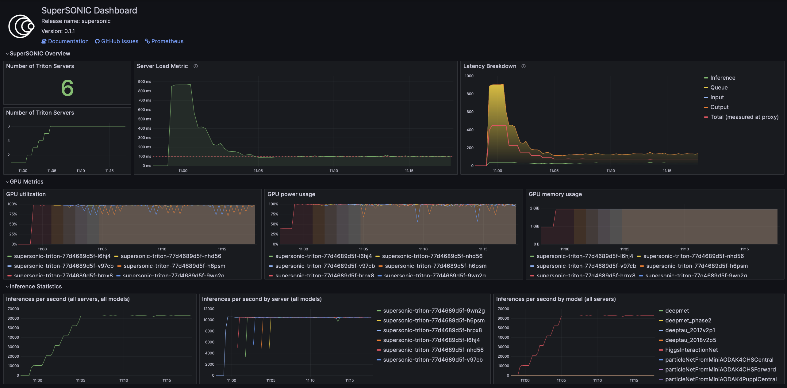

Configuration Guide
####################

The following guide will help you configure ``values.yaml`` file for a SuperSONIC deployment.
The full list of parameters can be found in the `Configuration Reference <configuration-reference>`_.

You can find example values files in the `SuperSONIC GitHub repository <https://github.com/fastmachinelearning/SuperSONIC/tree/main/values>`_.

1. Select an Inference Server
=============================================

The server is selected with ``inferenceServer.type`` and its version with ``inferenceServer.image``.

**Triton** (``type: triton``, default)

- Official versions can be found at `NVIDIA NGC <https://ngc.nvidia.com/catalog/containers/nvidia:tritonserver>`_.
- You can also use custom-built Triton images.
- Refer to the `Nvidia Frameworks Support Matrix <https://docs.nvidia.com/deeplearning/frameworks/support-matrix/index.html>`_
  for compatibility information (CUDA versions, NVIDIA drivers, etc.).

**Nereid** (``type: nereid``)

- `Nereid <https://github.com/ngpaladi/nereid-server>`_ serves the same KServe v2 gRPC protocol
  as Triton, so Envoy, autoscaling and monitoring work unchanged.
- It is configured through ``inferenceServer.nereid.config`` (rendered to ``nereid.yaml``) instead of
  command-line flags; see `values/values-nereid.yaml <https://github.com/fastmachinelearning/SuperSONIC/blob/main/values/values-nereid.yaml>`_.
- It does not export ``nv_gpu_*`` metrics (the GPU dashboard panels and ``metricsCollector`` stay
  empty), and its Python backend needs a writable model directory.

2. Configure the model repository
=============================================
   
- To learn about the structure of model repositories, refer to the
  `NVIDIA Model Repository Guide <https://docs.nvidia.com/deeplearning/triton-inference-server/user-guide/docs/user_guide/model_repository.html>`_.
- For Triton, model repositories are specified in the ``inferenceServer.args`` parameter in
  the values file. The parameter contains the full command that launches a Triton server; you can specify
  one or multiple model repositories via the ``--model-repository`` flag.
- For example, the following command loads multiple CMS models hosted at CVMFS:
     
.. code-block:: yaml

   args: 
     - |
      /opt/tritonserver/bin/tritonserver \
      --model-repository=/cvmfs/cms.cern.ch/el9_amd64_gcc12/cms/cmssw/CMSSW_14_1_0_pre7/external/el9_amd64_gcc12/data/RecoBTag/Combined/data/models/ \
      --model-repository=/cvmfs/cms.cern.ch/el9_amd64_gcc12/cms/cmssw/CMSSW_14_1_0_pre7/external/el9_amd64_gcc12/data/RecoTauTag/TrainingFiles/data/DeepTauIdSONIC/ \
      --model-repository=/cvmfs/cms.cern.ch/el9_amd64_gcc12/cms/cmssw/CMSSW_14_1_0_pre7/external/el9_amd64_gcc12/data/RecoMET/METPUSubtraction/data/models/ \
      --allow-gpu-metrics=true \
      --log-verbose=0 \
      --strict-model-config=false \
      --exit-timeout-secs=60 

- Make sure that the model repository paths exist. You can load models from a volume mounted to the inference server container.
  The following options for model repository mounting are provided via ``inferenceServer.modelRepository`` parameter in ``values.yaml``:

.. raw:: html

    

    
Model repository options

.. code-block:: yaml

   # -- Model repository configuration
   modelRepository:
     # Set to `true` to enable model repository mounting
     enabled: true

     # -- Model repository mount path (e.g /cvmfs/)
     mountPath: ""

     ## Model repository options:

     ## Option 1: mount an arbitrary PersistentVolumeClaim
     storageType: "pvc"
     pvc:
       claimName: 

     ## -- OR --
     ## Option 2: mount CVMFS as PersistentVolumeClaim (CVMFS StorageClass must be installed at the cluster)
     storageType: "cvmfs-pvc"
     
     ## -- OR --
     ## Option 3: mount CVMFS via hostPath (CVMFS must be already mounted on the nodes)
     storageType: "cvmfs-hostPath"

     ## -- OR --
     ## Option 4: mount an NFS storage volume
     storageType: "nfs"
     nfs:
       server:
       path:

     ## -- OR --
     ## Option 5: mount models from a ConfigMap (small models, at most 1 MiB in total)
     storageType: "configMap"
     configMap:
       name:

.. raw:: html

   

.. raw:: html

      

3. Select Resources for Inference Server Pods
=============================================

- You can configure CPU, memory, and GPU resources for inference server pods via the ``inferenceServer.resources`` parameter in the values file:

.. code-block:: yaml

   resources:
     limits:
       nvidia.com/gpu: 1
       cpu: 2
       memory: 16G
     requests:
       nvidia.com/gpu: 1
       cpu: 2
       memory: 16G

- In addition, you can use ``inferenceServer.nodeSelector``, ``inferenceServer.tolerations``,
  ``inferenceServer.annotations``, and ``inferenceServer.affinity`` to steer inference server
  pods to specific nodes. This is particularly useful for co-locating them with the Envoy
  proxy to reduce latency.

4. Configure Envoy Proxy
================================================

By default, Envoy proxy is enabled and configured to provide per-request
load balancing between inference servers.

Once the SuperSONIC chart is installed, you need an address by which clients
can connect to the Envoy proxy and send inference requests.

There are two options:

-  **Ingress** (recommended): Use an Ingress to expose the Envoy proxy to the outside world.
   You can configure the Ingress resource via the ``envoy.ingress`` parameters in the values file:

   .. code-block:: yaml

      envoy:
        ingress:
          enabled: true
          hostName: "<ingress_url>"
          ingressClassName: "<ingress_class>"
          annotations: {}

   In this case, the client connections should be established to  ``<ingress_url>:443`` and use SSL.

   For information on how to configure Ingress for your cluster, please refer to cluster documentation or contact cluster administrators.

-  **LoadBalancer Service**: This option allows to expose the Envoy proxy without using Ingress, but it may
   not be allowed at some Kubernetes clusters. To enable this, set the following parameters in the values file:

   - ``envoy.service.type: LoadBalancer``
   - ``envoy.ingress.enabled: false``
  
   The LoadBalancer service can then be mapped to an external URL, depending on the settings of a given cluster.
   Please contact cluster administrators for more information.

   In this case, the client connections should be established to  ``<load_balancer_url>:8001`` and NOT use SSL.

Some Envoy Proxy parameters, such as load balancing policy, rate limiting, and authentication,
can be cofigured directly in the ``values.yaml`` file as described in sections below.

Alternatively, you can provide an external Envoy configuration file to override the
default configuration completely (the configuration file must be supplied as a ConfigMap):

.. code-block:: yaml

   envoy:
     external_config:
       load_from_configmap: true
       configmap_name: external-envoy-config
       configmap_key: envoy.yaml

``scaleFromZero`` and the prometheus-based rate limiter work with an external
configuration only if it carries the clusters, Lua filter and routes that the generated
configuration would have added (see ``templates/envoy/configmaps.yaml``); the chart does
not check for them.

5. (Optional) Configure Rate Limiting in Envoy Proxy
======================================================
   
There are two types of rate limiting available in Envoy Proxy: *listener-level*, and *prometheus-based*.

- **Listener-level rate limiting** allows to explicitly limit the number of client connections established to the Envoy proxy endpoint.
  It can be useful to prevent overloading the proxy with too many simultaneous client connections.

  The listener-level rate limiting is implemented via "token bucket" algorithm.
  Each new connection consumes a token from the bucket, and the bucket is refilled at a constant rate.

  Example configuration in ``values.yaml``:

  .. code-block:: yaml

     envoy:
       enabled: true
       rate_limiter:
         listener_level:
           # -- Enable rate limiter
           enabled: false
           # -- Maximum number of simultaneous connections to the Envoy Proxy.
           max_tokens: 5
           # -- ``tokens_per_fill`` tokens are added to the "bucket" every ``fill_interval``, allowing new connections to be established.
           tokens_per_fill: 1
           # -- For example, adding a new token every 12 seconds allows 5 new connections every minute.
           fill_interval: 12s

- **Prometheus-based rate limiting** allows an additional layer of rate limiting based on a metric queried from a Prometheus server.
  This can be useful to dynamically control server load and stop accepting new connections when GPUs are saturated.

  This rate limiter can be enabled via the ``envoy.rate_limiter.prometheus_based`` parameter in the values file.

  At the moment, this functionality is configured to only reject ``RepositoryIndex`` requests to inference servers, and it ignores
  any other requests in order not to slow down the inferences.

  The rate limiter evaluates the autoscaler's scaling metric per healthy inference server replica and rejects
  ``RepositoryIndex`` requests above ``serverAdmissionThreshold`` (see step 8).

6. (Optional) Configure Authentication in Envoy Proxy
======================================================

At the moment, the only supported authentication method is JWT. Example configuration for IceCube:

.. code-block:: yaml

   envoy:
     auth:
       enabled: true
       jwt_issuer: https://keycloak.icecube.wisc.edu/auth/realms/IceCube
       jwt_remote_jwks_uri: https://keycloak.icecube.wisc.edu/auth/realms/IceCube/protocol/openid-connect/certs
       audiences: [icecube]
       url: keycloak.icecube.wisc.edu
       port: 443

7. Deploy a Prometheus Server or Connect to an Existing One
============================================================

Prometheus is needed to scrape metrics for monitoring, as well as for the rate limiter and autoscaler.

- **Option 1** (recommended): Deploy a new Prometheus server.

  This will allow to configure a shorter scraping interval, resulting in a more responsive
  rate limiter and autoscaler. Prometheus server typically uses only a small amount of resources
  and does not require special permissions for installation.

  This option installs Prometheus as a subchart, the default values for it are set to reasonable values.
  You can further customize the Prometheus installation by passing parameters from
  official Prometheus `values.yaml <https://github.com/prometheus-community/helm-charts/blob/main/charts/prometheus/values.yaml>`_ file
  under the ``prometheus`` section of the SuperSONIC values file:

  .. code-block:: yaml

     prometheus:
       enabled: true
       server:
         ingress:
           enabled: true
           ingressClassName: "<ingress_class>"
           hosts:
              - "<prometheus_url>"
           tls:
             - hosts:
                 - "<prometheus_url>"

  The parameters you will most likely need to configure in your values file are related to
  Ingress for web access to Prometheus UI.

  .. warning::

    This option requires permissions to list pods in the installation namespace.
    Permission validation is performed automatically: if you don't have the necessary permissions,
    an error message will be printed when running ``helm install`` command.

- **Option 2**: Connect to an existing Prometheus server.

  If you don't have enough permissions to install a new Prometheus server,
  you can connect to an existing one. If ``prometheus.external.enabled`` is set to ``true``,
  all  parameters in the ``prometheus`` section, except the ones under
  ``prometheus.external``, are ignored.

  .. code-block:: yaml

    prometheus:
      external:
        enabled: true
          scheme: "<https or http>"
          url: "<prometheus_url>"
          port: <prometheus_port>

8. (Optional) Configure Metrics for Scaling and Rate Limiting
===============================================================

The autoscaler and the Prometheus-based rate limiter share one Prometheus query,
set by ``serverLoadMetric`` and rendered in ``templates/_helpers/_scaling-metric.tpl``.

The default metric
-------------------

By default, SuperSONIC estimates **how many inference server replicas the current in-flight
work needs**::

   R_needed = L_envoy / max(L_service / R_healthy, 1)

The ``rate()`` of a cumulative time counter is the mean number of requests inside
that stage (Little's law):

- ``L_envoy`` — requests in flight between Envoy and the inference servers:
  ``sum(rate(envoy_cluster_upstream_rq_time_sum{...}[30s])) / 1e3``.
- ``L_service`` — requests being executed:
  ``(sum(rate(nv_inference_request_duration_us{...}[30s])) - sum(rate(nv_inference_queue_duration_us{...}[30s]))) / 1e6``.
- ``R_healthy`` — inference server endpoints Envoy routes to:
  ``max(envoy_cluster_membership_healthy{...})``.

Models are weighted by the time they consume, so the metric has no model-specific
constants. The ``clamp_min`` floors encode that a healthy replica can always
execute one request, which lets an idle fleet scale down, and keep the division
finite. The rate limiter uses the metric per healthy replica: 1 means nothing
queues, 2 means requests wait as long as they are served.

Requirements and limitations
-----------------------------

- Envoy must be enabled with the upstream cluster named ``inference_server_grpc_service``, and
  Prometheus must scrape Envoy and the inference servers with a ``release`` label (the chart
  defaults do both).
- All inference traffic must enter through Envoy; requests sent directly to the
  inference server service are not counted and scale the fleet down.
- Ensemble and BLS models are reported under the parent and under each composing
  model, so the metric under-reads overload for them; use a custom
  ``serverLoadMetric`` that excludes the parent models.
- Failed requests count as load. Envoy's default circuit breaker caps in-flight
  requests at 1024 per Envoy replica, invisibly to the metric.
- An empty query result (lost scrape target, missing ``release`` label) reads as
  zero load. An unreachable Prometheus keeps the current replica count and makes
  the rate limiter reject ``RepositoryIndex`` unless ``scaleFromZero`` is enabled.

Thresholds
-----------

- ``serverLoadThreshold`` (default ``1.5``) — KEDA scales to
  ``ceil(metric / threshold)``. ``1.5`` keeps queueing at about half the service
  time per replica; ``2`` tolerates "waiting ≈ serving". The unloaded floor is
  ~1.2–1.3, so values below that over-provision.
- ``serverAdmissionThreshold`` (default ``3``) — Envoy rejects new
  ``RepositoryIndex`` requests when the per-replica metric exceeds it. Keep it
  above ``serverLoadThreshold`` so admission is not gated at the operating point.
- ``serverLoadRateInterval`` (default ``30s``) — the ``rate()`` window; keep it
  at or above 4x the Prometheus scrape interval (``1m`` for a 15s scrape).

Fractional thresholds must come from a values file or ``--set-json``; ``--set``
passes decimals as strings. Envoy reads the query and the admission threshold at
startup, so restart its pods after changing them.

**Upgrading from the queue-latency metric**: remove a leftover
``serverLoadThreshold: 100``; with the default metric it pins the inference server at
``keda.minReplicaCount`` (``helm install`` warns). To keep the old behaviour, keep
the threshold, set ``serverAdmissionThreshold`` to the same value, and set
``serverLoadMetric`` to the old query::

   sum by (release) (rate(nv_inference_queue_duration_us{release="<release>"}[30s]))
   /
   sum by (release) ((rate(nv_inference_exec_count{release="<release>"}[30s]) * 1000) + 0.001)

Custom metrics
---------------

A custom ``serverLoadMetric`` is used verbatim by both consumers: KEDA compares
it with ``serverLoadThreshold`` (``keda.metricType`` then defaults to ``Value``,
i.e. per replica) and the rate limiter with ``serverAdmissionThreshold``, so set
both in the metric's units.

9. (Optional) Deploy Grafana Dashboard
==========================================

Grafana is used to visualize metrics collected by Prometheus.
We provide a pre-configured Grafana dashboard which includes many useful metrics,
including latency breakdown, GPU utilization, and more.

If you have a Grafana instance already installed, you can deploy SuperSONIC dashboars
by copying one of the JSON files from the
`SuperSONIC repository <https://github.com/fastmachinelearning/SuperSONIC/tree/main/helm/supersonic/dashboards>`_.

If you don't have a Grafana instance already installed, you can deploy one as a subchart of SuperSONIC,
in which case the dashboard will be automatically deployed.

You can further customize the Grafana installation by passing parameters from
official Grafana `values.yaml <https://github.com/grafana/helm-charts/blob/main/charts/grafana/values.yaml>`_ file
under the ``grafana`` section of the SuperSONIC values file:

.. code-block:: yaml

   grafana:
     enabled: true
     ingress:
       enabled: true
       ingressClassName: "<ingress_class>"
       hosts:
          - "<grafana_url>"
       tls:
         - hosts:
             - "<grafana_url>"

The values you will most likely need to configure in your values file are related to
Grafana Ingress for web access, and datasources to connect to Prometheus,

10. Enable KEDA Autoscaler
==========================================

Autoscaling is implemented via `KEDA (Kubernetes Event-Driven Autoscaler) <https://keda.sh/>`_ and
can be enabled via the ``keda.enabled`` parameter in the values file.

.. warning::

   Deploying KEDA autoscaler requires KEDA CustomResourceDefinitions to be installed in the cluster.
   Please contact cluster administrators if this step of installation fails.

``keda.minReplicaCount`` and ``keda.maxReplicaCount`` bound the number of inference servers.
``keda.pollingInterval`` is how often KEDA checks whether the trigger is active (scaling to
and from zero); scaling between one and ``maxReplicaCount`` follows the HPA sync period
(15 seconds). ``keda.cooldownPeriod`` is how long the metric must stay at or below
``keda.activationThreshold`` before KEDA scales to zero; with the default
``activationThreshold`` of 0 any traffic through Envoy keeps the fleet alive, and about 0.1
ignores probe traffic.

``keda.scaleUp`` and ``keda.scaleDown`` set the HPA behavior: at most ``stepsize`` replicas
per ``periodSeconds``, after a ``stabilizationWindowSeconds`` look-back. The defaults react
within one HPA evaluation and scale down after 90 seconds of low load:

.. code-block:: yaml

   keda:
     enabled: true

     minReplicaCount: 1
     maxReplicaCount: 10

     pollingInterval: 10
     cooldownPeriod: 300

     scaleUp:
       stabilizationWindowSeconds: 0
       periodSeconds: 15
       stepsize: 2
     scaleDown:
       stabilizationWindowSeconds: 90
       periodSeconds: 15
       stepsize: 2

Scaling down removes pods that may hold requests. A terminating pod keeps serving for
60 seconds while Envoy stops routing to it, and is then stopped; requests still running
at that point fail.

To keep **zero** inference server replicas when idle, set ``keda.minReplicaCount`` to ``0`` and enable
``scaleFromZero``. Envoy stays running. On a ``RepositoryIndex`` request (the first RPC
used by CMS SONIC clients), SuperSONIC scales the inference server to ``max(1, keda.minReplicaCount)``
replicas and returns the index only after Envoy has a healthy inference server upstream. KEDA then
scales up to ``maxReplicaCount`` using the Prometheus load metric. After
``scaleFromZero.holdMinReplicasSeconds`` with no further ``RepositoryIndex`` requests,
the ScaledObject minimum returns to ``keda.minReplicaCount``, and KEDA can scale back to zero.

.. code-block:: yaml

   envoy:
     enabled: true

   keda:
     enabled: true
     minReplicaCount: 0
     maxReplicaCount: 10

   scaleFromZero:
     enabled: true
     readyTimeoutSeconds: 300
     holdMinReplicasSeconds: 300

.. warning::

   The client deadline for ``RepositoryIndex`` must cover inference server startup. If no healthy
   upstream is available within ``scaleFromZero.readyTimeoutSeconds``, the index request
   is rejected.

``inferenceServer.replicas`` is unused when ``scaleFromZero`` is enabled; KEDA owns the replica
count. Helm upgrades keep the live ScaledObject ``minReplicaCount`` so they do not
interrupt an active hold. The hold deadline is stored as an annotation on the
ScaledObject, so the admission sidecars of multiple Envoy replicas share one hold
and none can release a peer's active hold. ``scaleFromZero`` requires ``keda.enabled`` and
``envoy.enabled``.

Do not set ``keda.zeroIdleReplicas: true`` together with ``minReplicaCount: 0``.
``zeroIdleReplicas`` sets KEDA ``idleReplicaCount`` to 0 and cannot scale from 0 back to 1
when the load metric is scraped from the inference server. Use ``scaleFromZero`` for that.

An example is ``values/values-geddes-cms.yaml``.

11. (Optional) Configure Metrics Collector for Running ``perf_analyzer``
=========================================================================

To collect Prometheus metrics when using ``perf_analyzer`` for testing,
a Metrics Collector can be deployed to format Prometheus metrics properly.
The Metrics Collector is installed as a subchart with most of the default
values pre-configured. To enable the Metrics Collector, set the
``metricsCollector.enabled`` parameter to ``true`` in your values file
and configure ingress settings if needed as shown below:

.. code-block:: yaml

    metricsCollector:
      enabled: true
      ingress:
        enabled: true
        hostName: "<metrics_collector_url>"
        ingressClassName: "<ingress_class>"
        annotations: {}

Running with ``perf_analyzer`` is then done with:

.. code-block:: bash

    perf_analyzer -m <model_name> -u <envoy_engress> -i grpc \
        --collect-metrics --metrics-url <metrics_collector_url>/metrics \
        --verbose-csv -f <out_csv_file_name>.csv

If ingress is not desired, port-forward the metrics collector service and call
``--metrics-url localhost:8003/metrics`` to access the metrics. 
