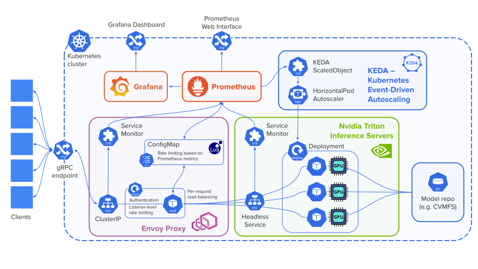

-------------------
Getting Started
-------------------

Pre-requisites
~~~~~~~~~~~~~~~

   1. `Kubernetes <https://kubernetes.io>`_ cluster
   2. `Prometheus <https://prometheus.io>`_ monitoring system 
   3. (if using autoscaling) `KEDA (Kubernetes Event-Driven Autoscaling) <https://keda.sh>`_

Installation
~~~~~~~~~~~~~~

   Modify the following command to install the chart at your cluster:

   .. code:: shell

      git clone https://github.com/fastmachinelearning/SuperSONIC
      cd SuperSONIC
      helm upgrade --install super-sonic ./helm --values values/your-values.yaml -n <namespace>

   Nicer installation from a Helm repository coming soon in `v0.1`

Uninstall SuperSONIC
~~~~~~~~~~~~~~~~~~~~~~~~~~

   .. code:: shell

      helm uninstall super-sonic  -n <namespace>

Architecture
~~~~~~~~~~~~~~~

The SuperSONIC Helm chart will install
components depicted at the diagram below, excluding Prometheus and model repository,
which must be connected by specifying relevant parameters in configuration file
(see :doc:`configuration reference <configuration-reference>`).

For correct behavior, the server saturation metric
(``prometheus.serverAvailabilityMetric``) used by Envoy proxy
and autoscaler must be carefully defined. It is recommended to start
with examining the metric in Prometheus interface, in order to define an
appropriate threshold and avoid typos in the metric definition.

The KEDA autoscaler can be enabled / disabled via the
``autoscaler.enabled`` parameter.

